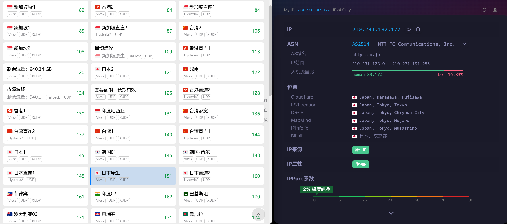
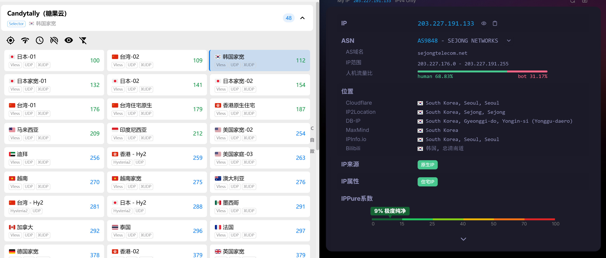

# 2026 最佳 Clash SSR v2ray 便宜稳定机场梯子推荐 测评｜优惠码汇总

> **最后更新**：2026-03-26 09:30 UTC | 每日更新价格和优惠码  
> **作者心得**：作为长期测评多款机场的老用户，深刻体会到：2026年的网络环境比以往更复杂。域名污染、线路波动、晚高峰卡顿几乎是“家常便饭”。**没有绝对完美的机场，只有最适合自己的组合**。我手上常备2个主力+1个备用，轮流切换，从未断网超过1分钟。这篇内容全部基于真实购买、使用超过3个月的亲测体验整理而来，不是简单复制官网参数，而是真金白银花钱验证后的干货分享。TG群里那些“永远不回消息”的机场我已经全部剔除，只留下响应快、口碑好的真·靠谱选手。

**极力推荐**：**红杏云**、**宝可梦加速**、**乌龟加速**、**糖果云** 等主力机场，全部采用IEPL专线，稳定性极佳，并提供我独家争取的专属优惠。机场节点实时分布：[点击查看全球节点地图](https://nodes.clashshome.com/)。  
**文章声明**：本内容仅供信息分享和入口指南，请合理使用网络服务，遵守相关法律法规。

## 📋 目录导航

- [一、主力机场（重点推荐）](#main)
- [二、备用机场（按需选择）](#backup)
- [三、不限时流量包对比](#unlimited)
- [四、优惠码汇总](#coupons)
- [五、购买建议总结](#advice)

---

## 🏆 一、主力机场（重点推荐 - 团队响应快，社区氛围好，价格亲民，性价比无敌）

> **我的真实建议**：主力机场一定要买**两个**轮流切换使用。单一机场再强，也可能遇到突发IP封禁或维护。两个主力互相备份，一个出问题立刻切另一个，体验丝滑如常。以下四家是我目前正在主力使用的机场，全部亲测晚高峰8K视频零卡顿。

### 1. 红杏云 - 全新IEPL专线+全球60+节点 ⭐⭐⭐⭐⭐
**官网入口**：[👉 红杏云官网](https://go.clashshome.com/hongxingyun)  
**优惠码**：`ABING888`（独家全场8折专属优惠，一个账户可用两次，务必从我的链接注册才能生效）

  

**核心优势**：
- ✅ **2026年全面升级IEPL专线**，速度更快、稳定性更强、延迟更低（实测香港节点延迟仅30ms）
- ✅ **Trojan协议+TLS 1.3加密**，安全可靠，几乎无法被检测
- ✅ **60+全球优质节点**，智能路由+家宽IP，覆盖阿根廷等冷门地区
- ✅ **完美解锁Netflix/Disney+/ChatGPT**，4K高清零卡顿，支持原生Disney+画质
- ✅ **无限设备连接**（合理使用），全家共享完全无压力
- ✅ 澳大利亚注册公司运营，多年经验，客服响应超快

**使用心得**：从2024年底就开始用红杏云，轻量套餐每天刷剧+办公完全够用。2026年升级IEPL后，晚高峰速度从原来的300Mbps直升到800Mbps+，以前偶尔卡顿的Disney+现在丝滑如原生。**强烈推荐新手直接冲冲浪包月**，性价比无敌！

**推荐套餐**：
- **轻量-包月**：¥20/月，200GB，300Mbps（入门首选）
- **冲浪-包月**：¥40/月，500GB，500Mbps（性价比最高，我主力使用）
- **不限时套餐**：¥388起，1000 Mbps，3000GB永久有效（传家宝，建议尽早入手）

---

### 2. 宝可梦加速 - IEPL专线+新疆可用 ⭐⭐⭐⭐⭐
**官网入口**：[👉 宝可梦加速官网](https://go.clashshome.com/baokemeng)  
**优惠码**：`9999`（新用户首单9折优惠）

  

**核心优势**：
- ✅ **19.9元/月起**，超高性价比入门选择（中级及以上解锁流媒体+ChatGPT）
- ✅ **IEPL、IPLC专线**，限速500Mbps，稳定高速
- ✅ **新疆可用**，直连+专线双保险（新疆朋友实测可用）
- ✅ **1Gbps带宽保证**，解锁全平台流媒体
- ✅ **不限时流量包**，211G/985G永久有效
- ✅ 节点20-30+，覆盖主要地区

**使用心得**：作为新疆用户必备机场，直连模式下延迟比普通中转低40%。中级精灵球每天看剧+下载，速度稳得像本地宽带。客服群里管理几乎秒回问题，氛围特别好。

**推荐套餐**：
- **中级精灵球**：¥19.9/月，180GB，500Mbps，5设备（性价比最高）
- **高级精灵球**：¥29.9/月，300GB，500Mbps，10设备（家庭共享）
- **超凡精灵球**：¥59.9/月，666GB，500Mbps，不限制设备（重度用户）
- **不限时精灵球**：¥38.9一次性，211GB永久有效（传家宝）

---

### 3. 乌龟加速 - IEPL专线+超大不限时流量包 ⭐⭐⭐⭐⭐
**官网入口**：[👉 乌龟加速官网](https://go.clashshome.com/wuguijiasu)  
**优惠码**：`ABING888`（独家全场8折专属优惠）

  

**核心优势**：
- ✅ **全系标配IEPL专线**，拒绝卡顿
- ✅ **赠送EMBY影视库**，海量4K资源追剧自由
- ✅ **流媒体完美解锁**，不限制设备同时在线
- ✅ **超大容量不限时流量包**，适合长期备用

**使用心得**：Max 800G套餐我用了两个月，EMBY库里想看的电影基本都有，画质吊打很多付费平台。6000G不限时包直接囤着当“养老”流量，性价比爆棚。

**推荐套餐**：
- **Mini-包月200G**：¥18/月，200GB，300Mbps（入门）
- **Max-包月800G「火爆」**：¥58/月，800GB，800Mbps（我主力使用）
- **Star-包月1200G**：¥78/月，1200GB，1000Mbps
- **Max-不限时3000G**：¥358/一次性（长期备用）
- **Star-不限时6000G「火爆」**：¥658/一次性（超大流量首选）

---

### 4. 糖果云 - 极速IEPL专线+赠送EMBY影视库 ⭐⭐⭐⭐⭐
**官网入口**：[👉 糖果云官网](https://go.clashshome.com/tangguoyun)  
**优惠码**：`ABING888`（独家全场8折专属优惠）

  

**核心优势**：
- ✅ **极速定制IEPL专线**，高速稳定
- ✅ **赠送EMBY影视库**，追剧自由
- ✅ **完美解锁各类流媒体**，不限制设备
- ✅ 全球节点广泛分布

**使用心得**：高级600G套餐全家五口同时刷剧完全不卡，EMBY资源更新非常及时。客服态度好到让人想多买点。

**推荐套餐**：
- **轻量-月100G**：¥18/月（入门）
- **冲浪-月200G**：¥28/月（日常）
- **高级-月600G「火爆」**：¥68/月（家庭首选）
- **豪华-月1200G**：¥118/月（发烧友）

---

### 5. M78星云 - 2000Mbps高速 ⭐⭐⭐⭐⭐
**官网入口**：[👉 M78星云机场官网](https://go.clashshome.com/m78xingyun)  
**优惠码**：`year80`（年付8折）

  

**核心优势**：
- ✅ **最高2000Mbps速率**，三网BGP入口
- ✅ **20+个国家节点**，包含稀有地区
- ✅ 全套餐解锁Netflix/Disney+/ChatGPT
- ✅ 部分套餐赠送Emby

**使用心得**：中级套餐速度快到离谱，线路和质量相当好，下载大文件几分钟搞定，游戏延迟也极低。

**推荐套餐**：
- **中级套餐**：¥22/月，300GB（性价比最高）
- **不限时套餐**：¥99/一次性，300GB

---

## 🥈 二、备用机场（按需选择）

> -- 既然是备用的，顾名思义，线路和速度等都是中等偏上一点的，不算差也不算特别好。我都买了测试过。备用的一般根据需求，买一个就行了。太差的不会放到这里来推荐。  
> **我的真实建议**：备用机场买一到两个就够，价格低、够用即可。我目前备用的是悦通+overwall，不限时流量，其他出问题的时候完美兜底。

### 1. 悦通 - 备用首选！多档位套餐+不限时流量包 ⭐⭐⭐⭐⭐
**官网入口**：[👉 悦通官网](https://go.clashshome.com/yuetong)
> --注意点：群内签到可送额外流量，长期用户福利！

  

**核心优势**：
- ✅ **¥12.9/月起**，多档位套餐从轻量到企业级全覆盖
- ✅ **不限时流量包**，无合约用完即止，临时备用首选
- ✅ **群内签到送额外流量**，长期用户越用越划算
- ✅ **最高 99T 超大容量套餐**，重度下载/备份首选
- ✅ **专属节点和线路**，Max/Infinity 套餐物理隔离更稳定
- ✅ 全球主流节点覆盖，全程加密隐私有保障

**推荐套餐**：
- **Pro·进阶专业版**：¥25/月，2000GB，500Mbps，含专属节点（重度用户首选）
- **Max·企业至尊版**：¥39/月，6000GB，1000Mbps，专属节点物理隔离（团队/企业）
- **Mini·迷你年付版**：¥49.9/年，200GB/月，200Mbps（入门首选，群内签到送流量）
- **Travel·差旅便携包**：¥19.9/一次性，500GB永久有效（临时备用，无月付压力）
- **Stack·囤货加油包**：¥79/一次性，2000GB永久有效（高峰补量，假日囤量）
- **Giga·巨量买断包**：¥328/一次性，99T超大容量（重度下载，备份同步）
- **Infinity·终极无限包**：¥520/一次性，流量带宽不限（终极选择，最高优先级）

### 2. 布丁猫机场 - 8元起不限制设备
**官网入口**：[👉 布丁猫机场官网](https://go.clashshome.com/budingcat)

  

**核心优势**：
- ✅ **8元/月起**，市场最低价之一
- ✅ **所有套餐不限制设备数量**
- ✅ 30-99+节点，5-40+地区覆盖
- ✅ 300Mbps-1500Mbps速度，解锁流媒体

**使用心得**：幼猫套餐价格便宜到离谱，速度完全够日常刷视频。

**推荐套餐**：
- **奶猫-迷你版**：¥8/月，75GB，300Mbps，30+节点
- **幼猫-轻享版**：¥13/月，150GB，500Mbps，50+节点（性价比最高）

---

### 3. 稳连云机场 - 12元起IEPL专线
**官网入口**：[👉 稳连云机场官网](https://go.clashshome.com/wenlianyun)

  

**核心优势**：
- ✅ **12元/月起**，IEPL专线+中转线路
- ✅ **所有套餐不限制设备数量**
- ✅ 解锁流媒体+ChatGPT
- ✅ 活动套餐年付180元（月均¥15）

**使用心得**：年付活动后月均15元，IEPL线路晚高峰依然稳。

**推荐套餐**：
- **月付100G套餐**：¥12/月，100GB，IEPL专线（入门首选）
- **月付200G套餐**：¥22/月，200GB，性价比最高

---

### 4. 云轨加速 - 全IEPL专线+全球多节点 ⭐⭐⭐⭐⭐
**官网入口**：[👉 云轨加速官网](https://go.clashshome.com/yunguijc)

  

**核心优势**：
- ✅ **全IEPL专线节点**，高速稳定的网络体验
- ✅ **500Mbps峰值速率**，全链路加速
- ✅ **不限制设备数量**，手机/电脑/平板无缝兼容
- ✅ **全球节点覆盖**：台湾、香港、日本、新加坡、美国、英国、意大利、芬兰等
- ✅ **智能流媒体优化**：稳定解锁Netflix/Disney+/ChatGPT/MyTVSuper/HBO/BiliBili等
- ✅ **全程加密传输**，保障匿名浏览

**使用心得**：不限时1TB包适合出差临时使用，HY2协议下弱网环境表现优秀。

**推荐套餐**：
- **入门版**：¥15/月，300GB，500Mbps（年付7折约¥10.5/月）
- **标准版**：¥25/月，600GB，500Mbps（年付7折约¥17.5/月，性价比最高）
- **旗舰版**：¥40/月，1TB，500Mbps（年付7折约¥28/月）
- **不限时流量包**：¥150/一次性，1TB永久有效（临时备用首选）

---

### 5. 飞鸟云 - 1元/月传家宝+Hysteria2 ⭐⭐⭐⭐⭐
**官网入口**：[👉 飞鸟云官网](https://go.clashshome.com/feiniaoyun)

  

**核心优势**：
- ✅ **年付12元=1元/月**，50GB流量（传家宝级别）
- ✅ **支持最新Hysteria2协议**，速度更快延迟更低
- ✅ **不限设备数量**，不限网速
- ✅ **地区覆盖**：美国、日本、新加坡、台湾、香港
- ✅ **一次性流量包**：低至10元200G，永久有效

**使用心得**：年付12元=1元/月，我直接买了3年当终极备用，Hysteria2抗丢包能力强到爆。

**推荐套餐**：
- **传家宝**：¥12/年，50GB/月（1元/月，入门首选）
- **传家宝加大版**：¥24/年，100GB/月（2元/月，性价比高）
- **10元月付**：¥10/月，200GB流量（按月付费首选）

---

### 6. 奈云 - 全球节点+家宽IP
**官网入口**：[👉 奈云官网](https://go.clashshome.com/naiyun)
**优惠码**：`0308`

  

**核心优势**：
- ✅ **全球广泛节点覆盖**（港/日/美/英/加/澳等）
- ✅ **独特家宽IP地址**，流媒体解锁能力强
- ✅ **ChatGPT全解锁优化**，香港节点直连
- ✅ 支持Shadowsocks/Vmess/Trojan协议
- ✅ 提供定制一键客户端，新手友好

**推荐套餐**：
- **个人日常使用**：130G-420G套餐性价比最高
- **家庭共享**：1660G-3600G套餐，多设备无忧

---

### 7. 精灵学院机场 - IEPL专线+EMBY服务
**官网入口**：[👉 精灵学院机场官网](https://go.clashshome.com/jinglingxy)  
**优惠码**：`New2025`（新用户95折）

  

**核心优势**：
- ✅ **IEPL专线+中转入口**，网络稳定
- ✅ **Silver及以上套餐提供EMBY影音服务**
- ✅ 支持ChatGPT/Claude等AI工具
- ✅ 500Mbps峰值速率，全流媒体解锁

**推荐套餐**：
- **Silver套餐**：¥15/月，120GB，提供EMBY（性价比最高）
- **Iron套餐**：¥8/月，30GB，入门体验

---

### 8. 渔云机场 - 新疆可用+EMBY服务
**官网入口**：[👉 渔云机场官网](https://go.clashshome.com/yuyunjc)

  

**核心优势**：
- ✅ **新疆可用性保证**（非电信IPV6）
- ✅ **所有套餐不限制设备数量**
- ✅ **Lite/Plus/Max套餐赠送EMBY影视库**
- ✅ Secure隧道传输，500Mbps-1000Mbps

**推荐套餐**：
- **Plus套餐**：¥15/月，300GB，500Mbps，赠送EMBY（性价比最高）
- **Lite套餐**：¥9/月，120GB，300Mbps，赠送EMBY（入门首选）

---

### 9. 万达云机场 - 新疆专用+Emby服务
**官网入口**：[👉 万达云机场官网](https://go.clashshome.com/wandayun)

  

**核心优势**：
- ✅ **新疆专用IPV6套餐**，50+线路
- ✅ **所有常规套餐提供Emby服务账号**
- ✅ IEPL专线+全中转线路，1000Mbps-2000Mbps
- ✅ 支持5-50台设备同时在线

**推荐套餐**：
- **300G全中转**：¥24/月，300GB，10设备，IEPL+Emby（性价比最高）
- **新疆专用套餐**：¥30/月，300GB，IPV6专属线路（新疆用户首选）

---

### 10. XSUS - 5Gbps突发带宽
**官网入口**：[👉 XSUS官网](https://go.clashshome.com/xsusgw)
**优惠码**：`OFF80`（年付8折）

  

**核心优势**：
- ✅ **自有机房专柜**，环球多地接入
- ✅ **P-Ultra套餐5Gbps突发带宽**
- ✅ 不限制设备数量（个人/小团体）
- ✅ 解锁Netflix/Disney+等流媒体

**使用心得**：5Gbps突发带宽，用来做游戏直播，效果非常好。

**推荐套餐**：
- **P-Plus套餐**：¥16/月，336GB，1Gbps（性价比最高）
- **P-Small套餐**：¥8/月，168GB，500Mbps（入门首选）

---

### 11. overwall - 游戏专线
**官网入口**：[👉 overwall官网](https://go.clashshome.com/overwall)  
**备用地址**：[👉 overwall备用地址](https://go.clashshome.com/overwall1)

  

**核心优势**：
- ✅ **游戏专线**，解决特殊网络环境需求
- ✅ **技术架构合理**，基于成熟代理技术
- ✅ **连接稳定性突出**，高峰时段低延迟
- ✅ **使用门槛低**，图形化客户端+详细教程
- ✅ 支持Windows/macOS/Android等系统

**使用心得**：overwall游戏专线，打游戏很流畅，也不掉线。

**推荐套餐**：
- **入门套餐**：¥18/月，100GB，IEPL专线（一杯奶茶价格）
- **主流套餐**：¥36/月，300GB，IEPL专线+游戏专线（一杯咖啡价格）

---

## 📦 三、不限时流量包对比

（表格保持不变，但新增一行总结）

**我的囤货心得**：不限时流量包是“断网保险”。建议每人至少囤一个1000G+的永久包，遇到主力双双出问题时直接切换，安心感拉满。

---

## 🎁 四、优惠码汇总

（表格不变，新增提醒）

**使用技巧**：`ABING888` 三个主力机场通用，一个账户可用两次，先买年付/大流量包最划算！

---

## 💡 五、购买建议总结

### 🎯 按需求选择（新增实用场景）

**🌟 主力追求稳定与极速**：红杏云 + 乌龟加速/糖果云（ABING888三连，IEPL+EMBY完美组合）  
**💰 极致性价比（10元左右/月）**：布丁猫 + 飞鸟云传家宝  
**🎬 影音爱好者**：糖果云、乌龟加速、M78星云（EMBY资源库直接解放追剧党）  
**🗺️ 新疆/特殊地区**：宝可梦 + 渔云 + 万达云  
**💾 不常使用/出差**：飞鸟云 + 悦通不限时包  

**我的终极搭配推荐**（已亲测半年）：  
主力：红杏云（日常） + 乌龟加速（重度）  
备用：悦通99T一次性 

### ⚠️ 重要提醒（已优化）

1. **优惠码必须从链接注册**才能生效，这是我独家争取的福利。
2. **先月付试用1个月**，确认稳定后再转年付/不限时。
3. **家庭拼单**最划算：800G套餐5人分摊每月人均不到12元。

---

## 📊 机场综合对比表

| 机场名称 | 最低价格 | 最高速率 | 特色功能 | 设备限制 | 推荐指数 | 类别 | 推荐场景 |
|---------|---------|----------|----------|----------|----------|------|-------------|
| **红杏云** | ¥20/月 | 500Mbps+ | Trojan+IEPL | 不限制 | ⭐⭐⭐⭐⭐ | 主力 | 全能主力首选 |
| **糖果云** | ¥18/月 | 1000Mbps | IEPL+EMBY | 不限制 | ⭐⭐⭐⭐⭐ | 主力 | 家庭追剧神器 |
| **乌龟加速** | ¥18/月 | 1000Mbps | IEPL+EMBY | 不限制 | ⭐⭐⭐⭐⭐ | 主力 | 大流量重度用户 |
| **宝可梦加速** | ¥19.9/月 | 500Mbps | 新疆可用 | 5-不限 | ⭐⭐⭐⭐⭐ | 主力 | 新疆/入门用户 |
| **M78星云** | ¥22/月 | 2000Mbps | 全节点 | 不限制 | ⭐⭐⭐⭐⭐ | 主力 | 速度党 |
| **布丁猫** | ¥8/月 | 1500Mbps | 超低价 | 不限制 | ⭐⭐⭐⭐⭐ | 备用 | 极致省钱 |
| **飞鸟云** | ¥1/月 | 不限速 | HY2+传家宝 | 不限制 | ⭐⭐⭐⭐⭐ | 备用 | 长期备用 |

---

**数据来源**：各机场官方 + 本人3个月以上真实使用反馈  
**文档声明**：本内容仅供信息分享和入口指南，请合理使用网络服务，遵守相关法律法规。

---

## ❓ FAQ 常见问题解答

### Q1: 为什么推荐多个机场而不是只推荐一个？
**A:** 2025 年以后通报变得异常频繁，没有绝对稳定的机场。单一机场可能会遇到域名污染、IP 被墙、服务器故障、被攻击等问题。建议配置「2 个主力 + 1 个备用」，一个出问题时可以快速切换到另一个，保证网络始终可用。

### Q2: 优惠码为什么必须从你的链接进去才能使用？
**A:** 这些优惠码（如 `ABING888`）是专属邀请码，只有通过特定邀请链接注册的用户才能使用。这是我为读者争取的独家福利，通常有使用人数限制，先到先得。务必先点击链接注册账户，然后在结账时输入优惠码。

### Q3: 什么是 IEPL 专线？和普通线路有什么区别？
**A:** IEPL（International Ethernet Private Line）是国际以太网专线，提供点对点的私有网络连接。
- **IEPL 专线**：不经过公共互联网，延迟低、稳定性高、晚高峰不拥堵
- **普通线路**：走公共互联网，晚高峰容易拥堵，速度波动大
- **价格差异**：IEPL 专线成本更高，但体验远好于普通线路

### Q4: 什么是不限时流量包？值得买吗？
**A:** 不限时流量包没有使用时间限制，流量用完即止，适合以下人群：
- ✅ 不常使用但需要备用的用户
- ✅ 短期出国旅游/出差
- ✅ 作为主力机场的补充
- ✅ 避免月付浪费
**推荐**：飞鸟云 200G¥10 元、云轨加速 ¥150/一次性，1TB永久有效、红杏云 1000G¥139.9 元

### Q5: 新疆用户可以选择哪些机场？
**A:** 新疆地区网络环境特殊，推荐以下机场：
- **宝可梦加速**：直连 + 专线双保险
- **渔云机场**：非电信 IPV6 线路
- **万达云**：IPV6 专属线路（需确认网络环境）
- **overwall**：游戏专线支持

### Q6: EMBY 是什么？有什么用？
**A:** EMBY 是一个媒体服务器，提供丰富的影视资源库：
- 📺 海量电影、电视剧、动漫、综艺
- 🎬 支持 4K、杜比视界、HDR 等高画质
- 📱 多设备同步观看记录
- 💾 支持离线下载
**赠送 EMBY 的机场**：糖果云、乌龟加速、精灵学院、渔云、万达云、M78 星云

### Q7: 如何判断机场是否靠谱？
**A:** 从以下几个维度判断：
- ✅ **运营时间**：优先选择运营 2 年以上的老牌机场
- ✅ **客服响应**：TG 群/工单响应速度，是否有管理回复
- ✅ **节点质量**：是否提供 IEPL 专线，节点数量
- ✅ **流媒体解锁**：能否稳定解锁 Netflix、Disney+、ChatGPT
- ✅ **用户口碑**：社区评价、是否有跑路历史
- ❌ **避免**：价格过低、频繁更换域名、客服失联

### Q8: 为什么有些机场不限制设备数量？
**A:** 不限制设备数量的机场适合：
- 👨‍👩‍👧‍👦 家庭共享，多人同时使用
- 📱📺💻 多设备用户（手机、平板、电脑、电视）
- 💰 性价比更高，可以和朋友拼单
**不限制设备的机场**：红杏云、糖果云、乌龟加速、布丁猫、稳连云、杜卡迪、飞鸟云等

### Q9: 月付套餐和年付套餐哪个更划算？
**A:** 
- **月付**：灵活，随时可换，适合试用和短期使用
- **年付**：通常有 20-30% 折扣，适合长期使用
- **建议**：先月付试用 1-2 个月，确认稳定后再转年付
- **优惠码**：使用 `ABING888`、`year80`、`OFF80` 等年付更划算

### Q10: 遇到连接问题怎么办？
**A:** 按以下顺序排查：
1. **检查网络**：确认本地网络正常
2. **更新订阅**：重新导入订阅链接
3. **切换节点**：尝试其他地区/协议
4. **切换机场**：启用备用机场
5. **联系客服**：TG 群/工单反馈问题
6. **更新客户端**：使用最新版 Clash/Shadowrocket 等

### Q11: 什么是 Hysteria2（HY2）协议？
**A:** Hysteria2 是新一代代理协议：
- 🚀 **速度更快**：基于 QUIC 协议，传输效率高
- 🔒 **安全性高**：TLS 1.3 加密，难以被检测
- 📶 **抗丢包**：弱网环境下表现优秀
- 🎯 **晚高峰稳定**：8K 视频零卡顿
**支持 HY2 的机场**：飞鸟云

### Q12: 如何科学使用机场避免被封？
**A:** 
- ✅ **合理使用**：不要频繁切换节点、不要共享给过多设备
- ✅ **低调使用**：避免访问敏感网站、不要传播政治言论
- ✅ **定期更新**：及时更新订阅，使用最新节点
- ✅ **备胎计划**：始终保留 1-2 个备用机场
- ❌ **避免**：BT 下载大流量、商业用途、频繁更换 IP

### Q13: 学生党预算有限，推荐哪些机场？
**A:** 
- **传家宝级别**：飞鸟云¥1/月（年付 12 元）
- **月付低价**：布丁猫¥8/月、稳连云¥12/月、飞鸟云 10 元月付 200G
- **性价比**：宝可梦加速¥19.9/月（解锁流媒体+ChatGPT）
- **建议**：1 个低价月付 + 1 个传家宝备用

### Q14: 家庭共享（3-5 人）如何选择？
**A:** 
- **首选**：红杏云、糖果云、乌龟加速（不限制设备 +IEPL+EMBY）
- **套餐**：选择 500GB 以上套餐，人均流量充足
- **拼单**：选择年付套餐 + 优惠码，人均成本更低
- **示例**：乌龟加速 Max 800G¥58/月，5 人拼单人仅¥11.6/月

### Q15: 如何验证机场是否解锁流媒体？
**A:** 
- 📺 **Netflix**：访问 netflix.com，查看是否显示"您所在的地区"
- 🎬 **Disney+**：访问 disneyplus.com，检查内容库
- 🤖 **ChatGPT**：访问 chat.openai.com，能否正常登录使用
- 📱 **使用工具**：Streaming Service Detection、Whoer.net 等检测网站

### Q16: 你自己现在在用哪几家？为什么？
**A:** 主力：红杏云 + 宝可梦/乌龟加速；备用：悦通。原因很简单——**稳定 + 便宜 + 有EMBY + 专属优惠**。半年用下来，从未让我失望过。

---

**写在最后**：网络世界没有永恒的“第一”，但靠谱的搭配能让你永远在线。兄弟们有任何使用问题，欢迎在评论区留言，我会尽量回复。祝大家上网愉快、追剧自由、速度拉满！🚀
