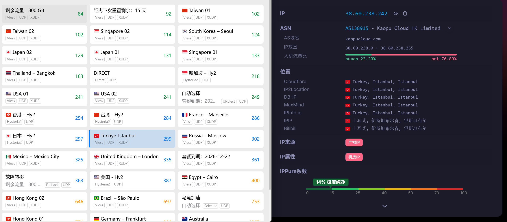
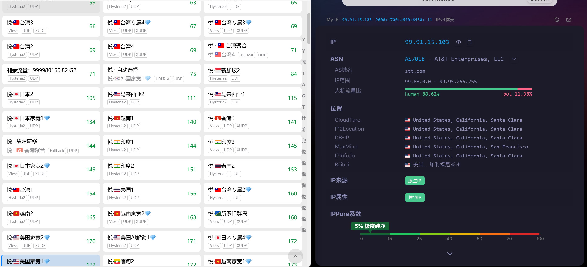

# 2026 最新机场推荐 | Clash / v2ray / SSR 稳定梯子真实测评与优惠码汇总

> 1. 真实测评：本仓库收录的机场均由本人真实付费并持续使用 3 个月以上。拒绝搬运官网宣传，严选 IEPL 专线与高性能中转直连节点，入选前必须通过晚高峰 4K 测速审核。  
> 2. 剔除劣质：已剔除所有 TG 群不回消息、口碑不稳的“跑路型”机场。仅保留响应快、出口带宽充足的优质服务商。  
> 3. 2+1 策略：独家分享 2 个主力 + 1 个备用的不限时流量包组合方案。过去一年实现 0 断网记录，帮助你根据预算精准选择最合适的便宜稳定机场。  
> 4. 优惠码：及时更新，部分有独家全场 8 折优惠码。  
> **最后更新**：2026-04-13 | 每周检查节点状态，随时更新最新动态。欢迎 Star 收藏防失联。[点击加入TG频道](https://t.me/best_jichang)

---

## 📢 近期公告

> 新增主力机场：[隐云](https://go.clashshome.com/yinyun)。近期严打情况下晚高峰表现稳定，是一家集IEPL、IPLC、BGP三网优化的中高端机场。运营时间一年左右，线路稳定，注册送3G试用。

---

## 2026 年机场应该怎么选？

用了好几年机场，踩了一堆坑之后才想明白：选机场不是看参数表，是看你能不能接受它特定的翻车方式。每家机场都会出问题，没有例外。区别只在什么时候出、出多久、你有没有备用。

### 🔴 难点一：晚高峰为什么总是卡？

**根本原因是带宽共享。** 平价中转机场的模型是：一条出口带宽，几千个用户共用。白天人少，速度还行；晚上高峰期一到，带宽被平摊到每人几 KB/s，YouTube 自然只能降到 480P。我之前买过一家 6 块钱的机场就是这样——白天飞快，晚上慢成 2G。之所以便宜，就是因为人够多、带宽够省。

> **怎么选**：要想晚高峰稳，要么选 IEPL 专线机场（独享线路，不受其他用户影响），要么在下单前确认是「独享带宽」而不是「共享带宽」。

### 🟡 难点二：节点全红连不上是怎么回事？

**不是机场挂了，是国内入口 IP 被通报了。** 机场的原理是：国内有一个「接入点」，你的流量先到接入点，再出境。这个接入点的 IP 一旦被通报封锁，所有节点就都连不上，官网也可能跟着打不开——机场本身还活着，只是入口被堵了。换 IP 和域名一般需要几小时到几天，这段时间完全断网。2025 年 7-9 月我亲历过：主力机场连续三天入口全封，期间全靠提前囤的备用包撑着。

> **怎么选**：主力和备用机场的入口类型要不一样（比如一个移动骨干、一个电信），两家不会同时被封。同时囤一个不限时流量包当应急底牌。

### ⚫ 难点三：怎么判断一家机场会不会跑路？

**没有绝对可靠的方法，但有明显的红旗信号：**

- 折扣力度异常大（买一年送一年、全场一折）
- TG 频道长时间无更新，或只有广告没有维护公告
- 找不到任何真实用户在独立论坛（Nodeseek / V2EX）的使用反馈

运营两年以上、有活跃 TG 群、能在第三方论坛找到真实用户讨论的机场，跑路概率远低于新机场。

> **怎么选**：新机场先月付试用 1-2 个月，稳定后再转年付；不要一次性投入大流量年付包，跑路了损失翻倍。

**三种线路类型，对应三种断网风险**：

| 线路类型 | 主要风险 | 适合场景 |
|---------|---------|---------|
| 直连 | 速度翻车概率高，跑路风险也高 | 纯备用 / 极度省钱 |
| 公网中转 | 晚高峰容易卡顿，通报期间容易入口被封 | 预算有限，能接受偶尔波动 |
| IEPL/IPLC 专线 | 贵，新疆基本用不了，但速度翻车概率最低 | 主力首选，有预算追求稳定 |

**我现在的搭配逻辑**：主力用 IEPL 专线（防止高峰卡顿）；备用用不限时包，且入口网络不同于主力（防止同时被封）；两家机场从不同 TG 群认知，口碑来源不交叉（降低同时跑路概率）。

> **机场那些坑，买多了才知道**：  
> ❌ 线路看上去很多但入口/落地高度复用 → 一打全军覆没  
> ❌ 只买一家机场 → 断网时完全没有退路  
> ❌ 一次买年付大流量 → 机场跑路损失翻倍  

**记住这条真理**：机场便宜不好用，好用不便宜。你选的每一家便宜机场，要么在速度上亏，要么在稳定性上亏，要么在寿命上亏——三选一，没有例外。

---

## 📋 目录导航

- [一、主力机场（重点推荐）](#main)
  - [1. 红杏云](#hongxingyun)
  - [2. 宝可梦加速器](#baokemeng)
  - [3. Mitce](#mitce)
  - [4. 隐云](#yinyun)
  - [5. 万达云](#wandayun)
- [二、备用机场（按需选择）](#backup)
  - [1. overwall](#overwall)
  - [2. 乌龟加速](#wuguijiasu)
  - [3. 飞鸟云](#feiniaoyun)
  - [4. M78星云](#m78)
  - [5. 奈云](#naiyun)
  - [6. 渔云Cloufisher](#yuyun)
  - [7. 悦通](#yuetong)
  - [8. XSUS](#xsus)
  - [9. 布丁猫](#budingcat)
  - [10. 魔戒](#mojie)
- [三、优惠码汇总](#unlimited)
- [四、选择策略](#choose)
- [FAQ 常见问题](#faq)
- [更新纪录](#update)

---

## 一、主力机场（重点推荐）

> **真实建议**：主力机场一定要买**两个**轮流切换。单一机场再强，也可能遇到突发 IP 封禁或维护。两个主力互相备份，一个出问题立刻切另一个，体验丝滑如常。

---

### 1. 红杏云 - 50多个节点（直连 + 家宽 + 原生 + 推荐使用官方客户端有更多原生独立线路）

**官网入口**：
- [红杏云官网](https://go.clashshome.com/hongxingyun)

**优惠码**：`ABING888`（全场 8 折，一个账户可用两次）

**机场档案**
| 项目 | 详情 |
|------|------|
| 开业时间 | 2023 年 |
| 老板肉身 | 境外 |
| 入口与过境 | 香港 |
| 节点地区 | 香港、台湾、日本、新加坡、美国、韩国、英国、德国等 |
| 落地 ISP | Sakura Link Limited、Amazon.com（AWS） |
| 节点数量 | 50+ |
| 协议 | Vless + Hysteria2 |
| 设备限制 | 不限制（合理使用） |
| AI流媒体解锁 | AI全解锁 · Netflix / Disney+ / YouTube Premium |
| 审计情况 | 无审计 |
| 付款方式 | 支付宝 / 微信 / USDT |
| TG 频道 | [点击加入](https://t.me/Hongxingyun_bot) |
| 一键客户端 | Windows / Mac / Android / iOS / 软路由 |

**核心优势**：
- ✅ 专线 + 多地家宽、原生IP，晚高峰稳定，客服工单回复速度快
- ✅ 50+节点，94% 可用率，实测平均延迟仅 52ms
- ✅ 完美解锁 Netflix/Disney+/ChatGPT，附赠 EMBY 影视库
- ✅ 不限设备，全家共享无压力

**缺点**：
- 近期价格略微上涨

**我的使用体验**：从 2024 年底开始用，轻量套餐每天刷剧+办公完全够用。是一家价格实惠、生态完善的近乎全能的机场，适合大部分场景使用。

**推荐套餐**：

| 套餐名称 | 价格 | 流量 | 速率 | 备注 |
|---------|------|------|------|------|
| 轻量-包月 200G | ¥20/月 | 200GB | 300Mbps | 入门首选，支持季付/年付优惠 |
| 冲浪-包月 500G | ¥40/月 | 500GB | 500Mbps | 性价比最高，我主力使用 |
| 豪华-包月 800G | ¥60/月 | 800GB | 800Mbps | 重度用户 |
| 大师-包月 1200G | ¥80/月 | 1200GB | 1000Mbps | 高强度使用 |
| 高级-不限时 3000G | ¥388/一次性 | 1000Mbps | 永久有效 |  |
| 豪华-不限时 6000G | ¥688/一次性 | 1000Mbps | 最多 20 台设备 |  |

  

---

### 2. 宝可梦加速器 - IEPL/IPLC + 新疆可用

**官网入口**：
- [宝可梦加速器官网](https://go.clashshome.com/baokemeng)

**优惠码**：`9999`（新用户首单 9 折）

**机场档案**
| 项目 | 详情 |
|------|------|
| 开业时间 | 2024 年 |
| 老板肉身 | 境外 |
| 入口与过境 | 国内、香港、马来西亚 |
| 节点地区 | 香港（含家宽）、台湾（含家宽）、日本、新加坡、美国、韩国等 30+ 节点 |
| 落地 ISP | China Mobile、Microsoft Azure、PCCW（香港）、MoeChuang |
| 节点数量 | 100+ |
| 协议 | Trojan + SS + Hysteria2 + VLESS |
| 设备限制 | 5 台（中级）/ 10 台（高级）/ 不限（超凡） |
| AI流媒体解锁 | 中级及以上（ChatGPT + 全平台流媒体） |
| 审计情况 | 无审计 |
| 付款方式 | 支付宝 / 微信 |
| TG 群 | [点击加入](https://t.me/pokemon_love) |
| 一键客户端 | Android / Windows / Mac |

**核心优势**：
- ✅ ¥7.9/月起，入门精灵球 60G，最低价之一
- ✅ 新疆可用，直连 + 专线双保险（新疆朋友实测可用）
- ✅ IEPL、IPLC 专线，限速 500Mbps，稳定高速
- ✅ 100 节点，覆盖中国/香港/马来西亚

**缺点**：
- 整体可用率 78%，有约 22 个节点超时，需切换节点使用，但是节点数量够多
- 入门套餐不含流媒体和 ChatGPT，需要中级以上，部分高级节点有倍率

**我的使用体验**：新疆用户必备，直连模式延迟低。中级精灵球日常看剧稳定，客服群响应快。

**推荐套餐**：

| 套餐名称 | 价格 | 流量 | 速率 | 备注 |
|---------|------|------|------|------|
| 入门精灵球 | ¥7.9/月 | 60GB | 200Mbps | 体验入门；5 设备 |
| 中级精灵球 | ¥19.9/月 | 180GB | 500Mbps | 性价比首选；5 设备 |
| 高级精灵球 | ¥29.9/月 | 300GB | 500Mbps | 家庭共享；10 设备 |
| 超凡精灵球 | ¥59.9/月 | 666GB | 500Mbps | 重度用户；不限设备 |
| 私人定制 | ¥299/月 | TikTok直播/外贸专用 | 原生IP | 按需定价 |

  

---

### 3. Mitce - 住宅IP+Hysteria2协议+稳定

**官网入口**：
- [Mitce官网](https://go.clashshome.com/mitcejc)

**优惠码**：`SAKURA2026`（日本优化线路套餐锁定终身 8 折）

**机场档案**
| 项目 | 详情 |
|------|------|
| 开业时间 | 2023 年 |
| 老板肉身 | 境外 |
| 入口与过境 | 国内直连优化（三网近期加强）、香港、新加坡等 |
| 节点地区 | 日本（大量家宽/直连）、美国、英国、德国、新加坡、台湾、香港等30+国家和地区（含住宅IP） |
| 落地 ISP | AWS（Amazon）、住宅ISP等 |
| 节点数量 | 70+（含Hysteria2和VLESS节点） |
| 协议 | VLESS + Reality、Hysteria2（主推，抗封锁强）、部分Hysteria2带Salamander obfs |
| 设备限制 | 5-10台 |
| AI流媒体解锁 | 全平台（Netflix、YouTube 4K/8K、Disney+、ChatGPT等） |
| 审计情况 | 无审计 |
| 付款方式 | 支付宝、微信、PayPal、信用卡、USDT TRC20 |
| TG 频道 | [点击加入](https://t.me/Mitce_IDGAF) |
| 一键客户端 | 仅支持订阅，无原生客户端 |

**核心优势**：

- ✅ **全套餐包含住宅IP**，解锁流媒体能力强
- ✅ **支持Hysteria2协议**，速度更快延迟更低
- ✅ **全球广泛节点覆盖**（美/日/英/港/新等）
- ✅ **完美解锁Netflix/Disney+/ChatGPT**，4K高清零卡顿
- ✅ **不限制设备数量**，全家共享完全无压力
- ✅ **6000G不限时流量包**，长期备用首选

**缺点**：
- 近期晚高峰部分节点卡

**使用心得**：Mitce的住宅IP套餐是我最近发现的宝藏机场，Hysteria2协议配合住宅IP，晚高峰看4K Netflix完全不卡顿。日本优化套餐专门针对电信做了优化，所以推荐日本的套餐，日本节点延迟仅30ms，打游戏非常流畅。另外v2rayN效果比clash要好。   

**推荐套餐**：

| 套餐名称 | 价格 | 流量 | 速度 | 说明 |
|---------|------|------|------|------|
| Basic | $0.60/月 | 100GB | 1000Mbps | 入门首选 |
| Standard | $1.20/月 | 500GB | 1000Mbps | 性价比最高 |
| Pro | $2.00/月 | 1000GB | 1000Mbps | 主力使用 |
| 无限流量套件 | $3.00/月 | 不限制 | 1000Mbps | 重度用户 |
| Japan-Basic | $1.50/月 | 60GB | 100Mbps | 日本专线 |
| Japan-Pro | $3.00/月 | 200GB | 100Mbps | 日本专线+优化 |
| 团队定制 | $30/月 | 自定义 | 自定义 | 企业级解决方案 |

  

---

### 4. 隐云 - 独家云端分流引擎 + 魔法节点（双模式按需购买，支持独立节点 + 注册送3G试用）

**官网入口**：
- [隐云官网](https://go.clashshome.com/yinyun)

**机场档案**
| 项目 | 详情 |
|------|------|
| 开业时间 | 2025年 |
| 老板肉身 | 境外 |
| 入口与过境 | 混合：33 个国内入口 + 1 个境外直连 |
| 节点地区 | 香港、台湾、日本、美国、新加坡、欧洲国家等 |
| 落地 ISP | CHINANET Guangdong province network、Amazon Technologies Inc. |
| 节点数量 | 163 个 |
| 协议 | Trojan  |
| 设备限制 | 专属客户端限2-10台 / 通用订阅不限设备 |
| AI流媒体解锁 | 支持流媒体AI解锁 |
| 审计情况 | 无，为明确告知 |
| 付款方式 | 支付宝 / 微信 / USDT |
| TG 频道 | [点击加入](https://t.me/yinyunltd) |
| 一键客户端 | Windows / Mac / Android / iOS |

**核心优势**：
- ✅ 独家云端分流引擎，服务端智能分流，无需客户端复杂配置
- ✅ 163个节点，99% 可用率，实测平均延迟仅 37ms
- ✅ 双模式按需购买（专属客户端无限流量 / 通用订阅无限设备）
- ✅ 支持购买独立节点（原生IP，静态住宅IP，适合出海业务）

**缺点**：
- 运营时间不长，价格略贵

**我的使用体验**：隐云的“魔法节点”和云端分流引擎体验非常新颖，免去了繁琐的客户端配置。双模式套餐设计灵活，专属客户端适合大流量用户，通用订阅适合多设备用户。平均延迟极低，仅37ms，连接非常稳定。

**推荐套餐**：

| 套餐名称 | 价格 | 流量 | 速率 | 备注 |
|---------|------|------|------|------|
| 轻量版 (通用订阅) | ¥25/月 | 150GB | 100Mbps+ | 设备不限，最受欢迎 |
| 轻量版 (专属客户端) | ¥29/月 | 不限流量 | 100Mbps+ | 限制 2 台设备 |
| 标准版 (通用订阅) | ¥49/月 | 400GB | 100Mbps+ | 设备不限 |
| 标准版 (专属客户端) | ¥49/月 | 不限流量 | 100Mbps+ | 限制 5 台设备 |
| 高级版 (通用订阅) | ¥99/月 | 1024GB | 100Mbps+ | 设备不限 |
| 高级版 (专属客户端) | ¥99/月 | 不限流量 | 100Mbps+ | 限制 10 台设备 |
| 独立节点 (静态住宅IP) | ¥199/个/月 | 随主套餐 | 100Mbps+ | 需搭配主套餐使用 |

  

---

### 5. 万达云 - 专线 + 家宽 + 稳定、抗封锁能力强

**官网入口**：
- [万达云官网](https://go.clashshome.com/wandayun)

**机场档案**
| 项目 | 详情 |
|------|------|
| 开业时间 | 2023 年 |
| 入口与过境 | IEPL 专线 + 全中转线路 |
| 节点地区 | 多地区都有家宽，台湾、韩国、印度、美国、印度尼西亚、英国、德国等 |
| 落地 ISP | Akari Networks（香港）、Oracle Cloud（美国云）、Terabix（马来西亚）、Suburban Broadband（尼日利亚）、Metfone（柬埔寨）、HKT香港电讯（香港）等 |
| 节点数量 | 40-119 条线路（按套餐） |
| 协议 | Trojan |
| 设备限制 | 5 - 50 台（按套餐） |
| 峰值速率 | 1000Mbps - 2000Mbps |
| AI流媒体解锁 | 全流媒体解锁 |
| 审计情况 | 有审计（屏蔽BT/种子/磁力链、极端组织；不保留访问记录） |
| 付款方式 | 支付宝 / 微信 / USDT |
| TG | [点击加入](https://t.me/wandayunxyz) |
| 一键客户端 | iOS / Windows / Android / Mac / Linux |

**核心优势**：
- ✅ 新疆专用 IPV6 套餐，50+ 线路
- ✅ 所有常规套餐提供 Emby 服务账号
- ✅ IEPL 专线 + 全中转线路，1000Mbps-2000Mbps
- ✅ 支持 5-50 台设备同时在线

**缺点**：
- 有内容审计（BT/极端组织屏蔽）
- 只支持官方客户端

**推荐套餐**：

| 套餐名称 | 价格 | 流量 | 速率 | 备注 |
|---------|------|------|------|------|
| 150G 全中转套餐 | ¥16.8/月 | 150GB | 40+ 线路、1000Mbps | 入门；5 设备 |
| 300G 全专线套餐 | ¥28.8/月 | 300GB | 70+ 线路、1000Mbps | 性价比；10 设备、IEPL |
| 600G 全专线套餐 | ¥48/月 | 600GB | 70+ 线路、1500Mbps | 50 设备 |
| 1200G 全专线套餐 | ¥92/月 | 1200GB | 119+ 线路、不限速度 | 50 设备、不限速 |
| 新疆专用套餐 | ¥36/月 | 300GB | 50+ 线路、1000Mbps | 新疆用户首选；IPV6 专属 |
| TikTok 优化套餐 | ¥41.8/月 | 270GB | 70+ 线路、2000Mbps | 3 设备 |
| 长效流量套餐 400G | ¥350/一次性 | 永久有效 | 30+ 线路、1500Mbps | 5 设备 |

  

---

## 二、备用机场（按需选择）

> 备用机场的定位：价格低、够用即可，不需要跟主力一样完美。建议买 1-2 个，遇到主力挂了直接切过去。我目前备用的是悦通不限时包 + 飞鸟云传家宝，两种形态搭配，长期打底。

---

### 1. overwall - IEPL 专线 + 游戏加速 + EMBY

**官网入口**：
- [overwall 官网](https://go.clashshome.com/overwall)
- [overwall 备用地址](https://go.clashshome.com/overwall1)

**优惠码**：`overwall.run`（9折）

**机场档案**
| 项目 | 详情 |
|------|------|
| 开业时间 | 2023 年 |
| 入口与过境 | 全部国内入口（电信 163 AS4134 接入） |
| 节点地区 | 台湾、日本、新加坡、美国、英国、德国、加拿大等 20多个国家及地区 |
| 落地 ISP | Chinanet（中国电信） |
| 节点数量 | 40+ |
| 协议 | ShadowSocks |
| 设备限制 | 不限制 |
| AI流媒体解锁 | 流媒体 AI 全面解锁 |
| EMBY | 会员专属 Emby 媒体库 |
| 审计情况 | 无审计 |
| 付款方式 | 支付宝 / 微信 |
| TG | [点击加入](https://t.me/overwallgroup) |
| 一键客户端 | 不支持原生客户端 |

**核心优势**：
- ✅ 43 节点 100% 全部可用，平均延迟仅 37ms，全场最低
- ✅ IEPL 专线 + 电信 BGP 入口，晚高峰 8K 不卡顿
- ✅ 免费 EMBY 媒体库
- ✅ 200G 套餐起含游戏专线
- ✅ 不限设备数量，物理层加密

**缺点**：
- 纯电信 BGP 接入，移动/联通用户跨网性能略低于电信用户
- 无原生客户端，需自行配置
- 价格比同类机场稍贵

**推荐套餐**：

*月付套餐*

| 套餐 | 月付 | 年付参考 | 备注 |
|------|------|---------|------|
| 100G/月 | ¥18 | ¥155/年 | |
| 200G/月 | ¥28 | ¥235/年 | 含游戏专线 |
| 300G/月 | ¥36 | ¥302/年 | 含游戏专线 |
| 500G/月 | ¥58 | - | 含游戏专线 |
| 1024G/月 | ¥108 | - | |

*不限时流量包*

| 流量 | 价格 |
|------|------|
| 100G | ¥38 |
| 200G | ¥70 |
| 500G | ¥140 |
| 1024G | ¥260 |

  

---

### 2. 乌龟加速 - IEPL 专线 + 超大不限时流量包 （近期暂时切直连线路）

**官网入口**：
- [乌龟加速官网](https://go.clashshome.com/wuguijiasu)

**优惠码**：`ABING888`（独家全场 8 折）

**机场档案**
| 项目 | 详情 |
|------|------|
| 开业时间 | 2025 年 |
| 老板肉身 | 境外 |
| 入口与过境 | 新加坡、香港 |
| 节点地区 | 新加坡、香港 |
| 落地 ISP | Amazon.com, Inc. |
| 节点数量 | 20+ |
| 协议 | Hysteria2 |
| 设备限制 | 不限制 |
| AI流媒体解锁 | 全平台流媒体（含 EMBY 影视库） |
| 审计情况 | 有审计（屏蔽邪教/BT/PT/政治敏感，不记录访问日志） |
| 退款政策 | 暂不支持退款 |
| 付款方式 | 支付宝 / 微信 / USDT |
| TG 频道 | [点击加入](https://t.me/wgjsq_bot) |
| 一键客户端 | 仅支持订阅，无原生客户端（后续将提供） |

**核心优势**：
- ✅ 全系标配 IEPL 专线，拒绝卡顿
- ✅ **赠送 EMBY 影视库**，海量 4K 资源追剧自由
- ✅ 流媒体完美解锁，不限设备同时在线
- ✅ **超大容量不限时流量包**，适合长期备用（最高 6000G）

**缺点**：
- 无原生客户端，需要自己配置 Clash/Surge 等
- 有内容审计机制（不记录日志，但屏蔽 BT 等高风险域名）

**我的使用体验**：Max 800G 套餐用了两个月，EMBY 库里想看的电影基本都有。6000G 不限时包直接囤着当"养老"流量。

**推荐套餐**：

| 套餐名称 | 价格 | 流量 | 速率 | 备注 |
|---------|------|------|------|------|
| Mini-包月 200G | ¥18/月 | 200GB | 300Mbps | 入门 |
| Pro-包月 500G | ¥38/月 | 500GB | 500Mbps | 日常使用 |
| Max-包月 800G「火爆」 | ¥58/月 | 800GB | 800Mbps | 性价比最高 |
| Star-包月 1200G | ¥78/月 | 1200GB | 1000Mbps | 重度用户 |
| Max-不限时 3000G | ¥358/一次性 | 3000G | 1000Mbps | 长期备用 |
| Star-不限时 6000G「火爆」 | ¥658/一次性 | 6000G | 1000Mbps | 超大流量首选 |

  

---

### 3. 飞鸟云 - 年付 12 元传家宝

**官网入口**：
- [飞鸟云官网](https://go.clashshome.com/feiniaoyun)

**机场档案**
| 项目 | 详情 |
|------|------|
| 开业时间 | 2022 年 |
| 入口与过境 | 境外直连 |
| 节点地区 | 香港、台湾、日本、新加坡、美国（5 个地区） |
| 落地 ISP | Chunghwa Telecom（HiNet 台湾）、Cloudflare |
| 节点数量 | 40+ |
| 协议 | Hysteria2 + Trojan + VLESS |
| 设备限制 | 不限制，不限速 |
| AI流媒体解锁 | 解锁 |
| 审计情况 | 无审计 |
| 付款方式 | 支付宝 / 微信 |
| TG 频道 | [点击加入](https://t.me/feiniaoyunjichang) |
| 一键客户端 | 不支持 |

**核心优势**：
- ✅ **年付 12 元 = 1 元/月**，50GB 流量（传家宝级别）
- ✅ 支持最新 **Hysteria2 协议**，抗丢包，弱网仍可用
- ✅ 不限设备数量，不限网速
- ✅ 不限时流量包选项丰富（200G ¥10 起，最高 10000G ¥300），可叠加

**缺点**：
- 节点可用率较低
- 全境外直连，无国内中转，延迟受运营商出口影响大

**我的使用体验**：年付 12 元当终极备用，Hysteria2 在弱网下抗丢包出色。但实测很多节点超时，主要靠少数香港/台湾节点撑着。当"有备无患"的 1元/月保险很值。

**推荐套餐**：

| 套餐名称 | 价格 | 流量 | 备注 |
|---------|------|------|------|
| 传家宝 | ¥12/年 | 50GB/月 | 1 元/月 |
| 传家宝加大版 | ¥24/年 | 100GB/月 | 2 元/月 |
| 传家宝超大版 | ¥48/年 | 200GB/月 | 4 元/月 |
| 月付 200G | ¥10/月 | 200GB |  |
| 月付 400G | ¥15/月 | 400GB |  |
| 月付 600G | ¥20/月 | 600GB |  |
| 不限时流量包（可叠加） | ¥10 - ¥300 |  | 200G - 10000G |

  

---

### 4. M78星云 - 三网 BGP + 最高 2000Mbps

**官网入口**：
- [M78星云官网](https://go.clashshome.com/m78xingyun)

**优惠码**：`year80`（年付 8 折）

**机场档案**
| 项目 | 详情 |
|------|------|
| 开业时间 | 2023 年 |
| 老板肉身 | 境外 |
| 入口与过境 | 全部国内入口（三网 BGP / 移动骨干 AS9808 接入） |
| 节点地区 | 台湾、日本、新加坡、美国、英国、德国、澳大利亚等 20 个国家及地区 |
| 落地 ISP | China Mobile communications corporation |
| 节点数量 | 40+ |
| 协议 | ShadowSocks |
| 设备限制 | 不限制 |
| 峰值速率 | 最高 2000Mbps |
| AI流媒体解锁 | ChatGPT（全套餐）· Netflix/Disney+（中级及以上，部分赠Emby） |
| 审计情况 | 无审计 |
| 付款方式 | 支付宝 / 微信 / USDT |
| TG 频道 | [点击加入](https://t.me/M78CheckIn_bot) |
| 一键客户端 | Windows / Android / Mac（推荐使用官方客户端获得更多节点）|

**核心优势**：
- ✅ **¥7.8/月起**，超高性价比入门
- ✅ 三网 BGP 入口，最高 2000Mbps，速度党首选
- ✅ 20+ 个国家节点，包含稀有地区
- ✅ 含 Emby 服务（超值/中级及以上）

**缺点**：
- 仅支持 SS 协议，协议安全性相比 Trojan 稍弱
- 轻量套餐不含 IEPL 游戏专线和 Premium 节点
- 本站暂无退款政策

**我的使用体验**：超值套餐速度快，49ms 平均延迟在同价位里属于顶级，Emby 库超万部 4K 影片免费看，性价比极高。

**推荐套餐**：

| 套餐名称 | 价格 | 流量 | 速率 | 备注 |
|---------|------|------|------|------|
| 轻量套餐 80G | ¥7.8/月 | 基础5地区 |  | 入门体验 |
| 中级套餐 150G | ¥12.8/月 | 20+国家 | 含 Emby | 性价比最高 |
| 超值套餐 300G「爆款」 | ¥22.8/月 | 全节点 | 含 Emby |  |
| 高级套餐 500G | ¥35/月 | 年付赠迪士尼车位 |  |  |
| 顶级套餐 1000G | ¥69.9/月 | 年付赠迪士尼车位 |  |  |
| 不过期套餐 300G | ¥99/一次性 | 含 6 个月 Emby |  |  |

  

---

### 5. 奈云 - 全球节点

**官网入口**：
- [奈云官网](https://go.clashshome.com/naiyun)

**优惠码**：`0308`

**机场档案**
| 项目 | 详情 |
|------|------|
| 开业时间 | 2021 年 |
| 入口线路 | 海外中转 |
| 节点地区 | 台湾、日本、美国、英国、德国、加拿大、澳大利亚等 30 多个国家及地区 |
| 落地 ISP | 待补充 |
| 节点数量 | 40+ |
| 协议 | Shadowsocks / V2ray / Trojan |
| 设备限制 | 5 |
| 峰值速率 | 5000 Mbps |
| AI流媒体解锁 | 解锁 |
| 套餐流量类型 | 按量计费 + 周期计费 |
| 审计情况 | 无审计 |
| 付款方式 | 支付宝 / 微信 |
| TG | [点击加入](https://t.me/v2naiun) |
| 一键客户端 | Windows / Mac / Android |

**核心优势**：
- ✅ 全球广泛节点（港/日/美/英/加/澳等）
- ✅ 多协议支持，定制一键客户端，新手友好
- ✅ 峰值 5000Mbps，不限速

**缺点**：
- 单账号限 5 台设备
- 价格偏贵，而且今年来体验感有降低，以前确实是非常好

**推荐套餐**：

| 套餐名称 | 价格 | 流量 | 备注 |
|---------|------|------|------|
| Basic-基础套餐 | ¥128/年 |  | 月均 ¥10.7 |
| Pro-进阶套餐 | ¥28/月 | 388G |  |
| Max-专业套餐 | ¥49/月 | 788G |  |
| 280G 不限时 | ¥118/一次性 |  | 注意：多次购买不可叠加 |
| 680G 不限时 | ¥218/一次性 |  |  |
| 2048G 不限时 | ¥498/一次性 |  |  |

  

---

### 6. 渔云Cloudfisher - 三网优化 + EMBY

**官网入口**：
- [渔云Cloudfisher官网](https://go.clashshome.com/yuyunjc)

**机场档案**
| 项目 | 详情 |
|------|------|
| 开业时间 | 2024 年 |
| 入口与过境 | 全部境外直连（无国内入口，中转+直连混合） |
| 节点地区 | 香港、台湾、日本、新加坡、美国（5 个地区） |
| 落地 ISP | Amazon.com, Inc.（AWS 新加坡） |
| 节点数量 | 30+ |
| 协议 | Hysteria2 + Trojan |
| 设备限制 | 不限制 |
| 峰值速率 | 300Mbps - 1000Mbps |
| AI流媒体解锁 | 主流流媒体及 AI 解锁 |
| 审计情况 | 无审计 |
| 付款方式 | 支付宝 / 微信 |
| TG | [点击加入](https://t.me/CloudFisherGroup) |
| 一键客户端 | 不支持原生客户端 |

**核心优势**：
- ✅ ¥9/月起，附赠 EMBY 影视库
- ✅ 不限设备数量
- ✅ 不限时流量包可选（300G ¥40、1000G ¥80）

**缺点**：
- 节点地区较少，但一般也够用

**推荐套餐**：

| 套餐名称 | 价格 | 流量 | 速率 | 备注 |
|---------|------|------|------|------|
| Lite 套餐 | ¥9/月 | 120GB | 300Mbps | 赠 EMBY |
| Plus 套餐 | ¥15/月 | 300GB | 500Mbps | 性价比最高；赠 EMBY |
| Max 套餐 | ¥25/月 | 500GB | 500Mbps | 赠 EMBY |
| Air 套餐 | ¥60/年 | 148GB/月 | 500Mbps | 年付省钱；赠 EMBY |
| 不限时 300G | ¥40/一次性 |  | 600Mbps | 出差备用 |
| 不限时 1000G | ¥80/一次性 |  | 1000Mbps | 大流量囤货 |

  

---

### 7. 悦通 - 多档位套餐 + 不限时流量包 | 机场新星

**官网入口**：
- [悦通官网](https://go.clashshome.com/yuetong)

> **注意**：群内签到可送额外流量，长期用户越用越划算！推荐使用官方客户端，TG 群非常活跃。

**机场档案**
| 项目 | 详情 |
|------|------|
| 开业时间 | 2025年中 |
| 老板肉身 | 境外 |
| 入口与过境 | 国内、多个境外 |
| 节点地区 | 台湾、日本、韩国、新加坡、美国、加拿大、英国、德国、越南等 40+ 国家及地区 |
| 落地 ISP | Vietnam Posts（越南电信）、Chunghwa Telecom（台湾HiNet）、Leaseweb、Daou Tech（韩国）、Light Node 等多家 |
| 节点数量 | 140+（可用率 62%） |
| 协议 | VLESS + Hysteria2 |
| 设备限制 | 5（普通），Max/Infinity 套餐物理隔离 |
| AI流媒体解锁 | 解锁 |
| 审计情况 | 无审计 |
| 付款方式 | 支付宝 / 微信 |
| TG 频道 | [点击加入](https://t.me/yue_to) |
| 一键客户端 | Windows / macOS / Android / Linux |

**核心优势**：
- ✅ ¥12.9/月起，多档位套餐从轻量到企业级全覆盖
- ✅ 不限时流量包，无合约用完即止，临时备用首选
- ✅ 群内签到送额外流量，长期用户越用越划算
- ✅ 最高 99T 超大容量套餐
- ✅ Max/Infinity 套餐物理隔离，更稳定

**缺点**：
- 普通套餐严格限制设备数 5 个
- 有时候节点可用率比较低

**推荐套餐**：

| 套餐名称 | 价格 | 流量 | 速率 | 备注 |
|---------|------|------|------|------|
| Mini·迷你年付版 | ¥49.9/年 | 200GB/月 | 200Mbps | 入门首选 |
| Air·轻量旗舰版 | ¥12.9/月 | 1000GB | 300Mbps |新增套餐，月付最佳入门 |
| Pro·进阶专业版 | ¥25/月 | 2000GB | 500Mbps | 含专属节点，重度用户首选 |
| Max·企业至尊版 | ¥39/月 | 6000GB | 1000Mbps | 团队/企业；物理隔离 |
| Travel·差旅便携包 | ¥19.9/一次性 | 500GB 永久有效 |  | 临时备用 |
| Stack·囤货加油包 | ¥79/一次性 | 2000GB | 500Mbps 永久有效 |  |
| Giga·巨量买断包 | ¥328/一次性 | 99T | 800Mbps 永久有效 |  |
| Infinity·终极无限包 | ¥520/一次性 | 流量带宽不限 |  |  |

  

---

### 8. XSUS - 移动骨干 + IEPL 企业专线

**官网入口**：
- [XSUS 官网](https://go.clashshome.com/xsusgw)

**优惠码**：`OFF80`（年付 8 折）

**机场档案**
| 项目 | 详情 |
|------|------|
| 开业时间 | 2022 年 |
| 入口与过境 | 全部国内入口（移动骨干 AS9808 为主 + 少量直连） |
| 节点地区 | 台湾、日本、新加坡、美国、英国、德国、韩国等 20多个国家及地区 |
| 落地 ISP | China Mobile communications corporation |
| 节点数量 | 60+ |
| 协议 | Trojan |
| 设备限制 | 不限制 |
| 峰值速率 | 500Mbps（P系列）/ 5Gbps 突发（P-Ultra）/ 500Mbps 保底（IEPL系列） |
| AI流媒体解锁 | Netflix / Disney+ 全热门节点保证 |
| 审计情况 | 无审计 |
| 付款方式 | 支付宝 / 微信 |
| TG 频道 | [点击加入](https://t.me/xsusvpn) |
| 一键客户端 | Windows / macOS / Android / iOS |

**核心优势**：
- ✅ 68 节点 100% 全部可用，零超时
- ✅ 自有机房专柜，环球多地接入
- ✅ P-Ultra 套餐 5Gbps 突发带宽
- ✅ IEPL 企业专线套餐可选（季付起）

**缺点**：
- 全移动骨干接入，电信/联通用户跨网延迟相对高（移动用户体验最佳）
- 5Gbps 是突发而非持续带宽
- IEPL 套餐起步较贵（季付 ¥48 起，仅 50G）

**推荐套餐**：

*P 系列（基础套餐）*

| 套餐名称 | 价格 | 流量 | 速率 | 备注 |
|---------|------|------|------|------|
| P-Small | ¥10/月 | 168G | 500Mbps | 入门首选 |
| P-Plus | ¥20/月 | 336G | 1Gbps | |
| P-Max | ¥24/月 | 420G | 1Gbps | 最高性价比 |
| P-Ultra | ¥58/月 | 1024G | 5Gbps 突发 | |

*IEPL 企业专线系列*

| 套餐名称 | 价格 | 流量/月 | 速率 | 备注 |
|---------|------|---------|------|------|
| IEPL-Small | ¥48 起/季 | 50G | 500Mbps 保底 | 物理直连 |
| IEPL-PLUS | ¥78 起/季 | 100G | 500Mbps 保底 | 物理直连 |

*不限时流量包*

| 流量 | 价格 |
|------|------|
| 188G | ¥65 |
| 240G | ¥82 |
| 400G | ¥122 |
| 1024G | ¥260 |

  

---

### 9. 布丁猫 - 8 元起不限设备 + 专线 + 三网BGP + 稳定

**官网入口**：
- [布丁猫官网](https://go.clashshome.com/budingcat)

**机场档案**
| 项目 | 详情 |
|------|------|
| 开业时间 | 2025 年 |
| 老板肉身 | 境外 |
| 入口与过境 | 国内、韩国、新加坡 |
| 节点地区 | 香港、台湾、日本、新加坡、美国、英国、韩国、越南、马来西亚等 15 个国家及地区 |
| 落地 ISP | Tencent Cloud（腾讯云）、Amazon.com |
| 节点数量 | 50+ |
| 协议 | VMess + VLESS |
| 设备限制 | 不限制 |
| AI流媒体解锁 | 解锁 |
| 审计情况 | 无审计 |
| 付款方式 | 支付宝 / 微信 |
| TG 频道 | [点击加入](https://t.me/budingcat) |
| 一键客户端 | 不支持原生客户端 |

**核心优势**：
- ✅ ¥8/月起，市场最低价之一
- ✅ 所有套餐不限制设备数量
- ✅ 最高 4T/月超大流量套餐可选
- ✅ 近期升级节点后非常稳定

**缺点**：
- 有倍率，看清线路倍率再使用。但是不得不说在这波清洗潮下布丁猫居然表现得非常优秀。

**我的使用体验**：我一直在用成猫-标准版。

**推荐套餐**：

| 套餐名称 | 价格 | 流量 | 速率 | 备注 |
|---------|------|------|------|------|
| 奶猫-迷你版 | ¥8/月 | 75GB | 300Mbps | 备用入门；5+地区 |
| 幼猫-轻享版 | ¥13/月 | 150GB | 500Mbps | 性价比；10+地区 |
| 成猫-标准版 | ¥22/月 | 300GB | 1000Mbps | 30+国家 |
| 大猫-旗舰版 | ¥38/月 | 600GB | 1500Mbps | 40+国家 |
| 喵皇-至尊版 1T | ¥58/月 | 1000GB | 不限速 | VIP通道 |
| 喵皇-至尊版 2T | ¥110/月 | 2000GB | 不限速 | VIP通道 |
| 喵皇-至尊版 4T | ¥209/月 | 4000GB | 不限速 | VIP通道 |

  

---

### 10. 魔戒 - 纯不限时流量包

**官网入口**：
- [魔戒官网](https://go.clashshome.com/mojieapp)

**机场档案**
| 项目 | 详情 |
|------|------|
| 开业时间 | 2020 年（老牌按量机场） |
| 入口与过境 | 全部境外直连 |
| 节点地区 | 香港、马来西亚、新加坡 |
| 落地 ISP | 乐速云、Microsoft Azure、Amazon AWS |
| 节点数量 | 40+（可用率 71%） |
| 协议 | VMess + AnyTLS + Hysteria2 |
| 设备限制 | 不限制 |
| AI流媒体解锁 | 解锁 |
| 审计情况 | 无审计 |
| 付款方式 | 支付宝 / 微信 / USDT / USDC |
| TG | [点击加入](https://t.me/Lord_Rings) |
| 一键客户端 | Windows / Mac / Android / iOS / Linux |

**核心优势**：
- ✅ **全部套餐均为不限时流量包**，无月付压力
- ✅ ¥1 起步可体验（2G 试用包）
- ✅ 不限设备，不限网速
- ✅ 支持流媒体，多客户端支持
- ✅ 支持 USDT/USDC 付款，隐私友好

**缺点**：
- 无周期套餐，只有一次性购买

**推荐套餐**（全部为不限时一次性）：

| 流量 | 价格 | 备注 |
|------|------|------|
| 2G | ¥1 | 仅供体验，不可续费 |
| 130G | ¥14.9 | |
| 420G | ¥42 | |
| 750G | ¥69 | |
| 1660G | ¥138 | |
| 3600G | ¥279 | |
| 10T | ¥688 | |

  

---

## 三、优惠码汇总

| 机场 | 优惠码 | 优惠内容 | 是否长期有效 |
|------|--------|---------|------------|
| 红杏云 | `ABING888` | 全场 8 折，账户可用 2 次 | 是 |
| 乌龟加速 | `ABING888` | 全场 8 折 | 是 |
| 宝可梦加速器 | `9999` | 新用户首单 9 折 | 是 |
| M78 星云 | `year80` | 年付 8 折 | 是 |
| XSUS | `OFF80` | 年付 8 折 | 是 |
| Mitce | `SAKURA2026` | 日本优化线路套餐锁定终身 8 折 | 是 |
| 奈云 | `0308` | 优惠折扣 | 否 |

> **⚠️ 重要提醒**：请在使用前自行核实优惠码是否仍然有效，部分优惠码有时效限制。建议注册前先在结算页面测试。

---

## 选择策略
用了这么多年梯子，我总结出这套 **「2 个主力 + 1 个备用」** 的组合方案。这也是我过去一年实现 **0 断网** 的底层逻辑：

### 为什么不能只买一家机场？
* **入口封锁风险**：再稳的机场，国内接入点（入口）一旦被封，修好需要几小时甚至几天，期间你会彻底失联。
* **晚高峰拥堵**：平价机场在高峰期容易带宽共享导致降速，多一家机场就多一个提速选择。
* **跑路风险**：鸡蛋不放一个篮子里，即便一家跑路，你还有时间寻找替代品。

### 「2+1 策略」深度拆解
| 角色 | 数量 | 核心要求 | 推荐配置逻辑 |
| :--- | :--- | :--- | :--- |
| **主力 A** | 1 个 | **IEPL 专线/BGP 中转** | 追求极致稳定，作为日常刷剧、办公的首选，选月付或季付。 |
| **主力 B** | 1 个 | **不同服务商/不同入口** | 与 A 形成互补。如果 A 是移动入口，B 最好选电信/联通入口，防止单点线路崩溃。 |
| **紧急备用** | 1 个 | **不限时流量包/永久有效** | **核心精髓**。平时不用，不扣钱。主力挂掉时，它就是你唯一的救命稻草。 |

### 💡 针对不同预算的「2+1」实操组合建议

#### 1. 极致性价比组（适合学生/轻度用户）
* **主力 A**：**[红杏云](https://go.clashshome.com/hongxingyun)** (综合体验最强)
* **主力 B**：**[万达云](https://go.clashshome.com/wandayun)** (线路稳定)
* **紧急备用**：**[飞鸟云](https://go.clashshome.com/feiniaoyun)** (¥12/年，传家宝极低成本打底)
* **总成本**：约 ¥16/月，买个双保险。

#### 2. 稳定办公/刷剧组（适合追求丝滑体验）
* **主力 A**：**[宝可梦加速器](https://go.clashshome.com/baokemeng)** (¥19.9/月，IEPL 专线保稳)
* **主力 B**：**[Mitce](https://go.clashshome.com/mitcejc)** (1.5USD/月，节点可用率高，流媒体解锁强)
* **紧急备用**：**[悦通](https://go.clashshome.com/yuetong)/[魔戒](https://go.clashshome.com/mojieapp) 不限时包** (一次性买断，备用首选)
* **总成本**：约 ¥40/月，晚高峰 4K 随意拖动。

#### 3. 进阶"养老"组（适合不想频繁续费的懒人）
* **主力 A**：**[隐云](https://go.clashshome.com/yinyun)** (高性能专线，IEPL、IPLC、三网优化，晚高峰体验无敌)
* **主力 B**：**[红杏云](https://go.clashshome.com/hongxingyun)**(综合体验最强，加上隐云几乎0断网)
* **备用组合**：**[魔戒](https://go.clashshome.com/mojieapp) 1660G 大流量包** + **[乌龟加速](https://go.clashshome.com/wuguijiasu) 3000G 不限时**
* **总成本**：一次性投入，后期极低月供，适合长期稳定选手。

---

## FAQ 常见问题解答

### Q1: 为什么推荐多个机场而不是只推荐一个？
A: 2025 年后通报变得异常频繁，没有绝对稳定的机场。单一机场可能遇到域名污染、IP 被墙、服务器故障。建议「2 个主力 + 1 个备用」，一个出问题时快速切换。

### Q2: 什么是 IEPL 专线？和普通线路有什么区别？
A: IEPL（International Ethernet Private Line）是国际以太网专线，提供点对点私有网络连接。
- **IEPL 专线**：不经过公共互联网，延迟低、稳定，晚高峰不拥堵
- **公网中转**：走公共互联网，高峰期可能拥堵，速度波动大
- **价格差异**：IEPL 成本更高，但体验远好于普通线路

### Q3: 什么是不限时流量包？值得买吗？
A: 不限时流量包没有使用时间限制，用完为止，适合：不常使用的用户 / 短期出差 / 备用 / 避免月付浪费。

### Q4: EMBY 是什么？有什么用？
A: EMBY 是一个私人媒体服务器平台，机场附赠的 EMBY 账号可以访问机场维护的资源库：
- 📺 海量电影、电视剧、动漫、综艺（通常几千到几万部）
- 🎬 支持 4K、杜比视界、HDR 高画质
- 📱 多设备同步观看记录，手机/电视/平板均可
- 💡 本质上是比 Netflix 便宜得多的资源补充

附赠 EMBY 的机场：红杏云、隐云、乌龟加速、渔云、万达云、M78 星云、overwall

> ⚠️ 注意：EMBY 授权是机场额外附赠的增值服务，终止时不属于违约。

### Q5: 遇到连接问题怎么办？
A: 按以下顺序排查：
1. **检查本地网络**：换个 WiFi 或开热点测试
2. **重新更新订阅**：机场经常会换节点 IP
3. **切换节点**：换其他地区或协议的节点
4. **查看 TG 官频**：机场一般会在 TG 频道发布维护通知
5. **切换备用机场**：这时候你就明白为什么要买备用了
6. **联系客服**：工单或 TG 群反馈，描述具体问题
7. **更新客户端**：Clash/Shadowrocket 等客户端过旧可能解析不了新节点

---

## 📌更新纪录
- 2026-04-13：新增主力机场：隐云。更新部分机场信息，新增overwall优惠码信息。
- 2026-04-08：新增TG频道，更新红杏云信息。
- 2026-04-05：更新仓库，收集整理所有机场梯子信息，编写文档。

---

## 免责声明

本文章内容根据各大机场和梯子公开的信息进行收集和整理，也都实际的购买测试过，只分享信息和使用心得，不构成任何购买建议。本项目的信息不具备永久时效性，有更新不及时的时候，请以官网最新的为准。所有的服务都是第三方运营，我也是一个消费者, 使用过程中产生的任何问题或风险，本项目概不承担。

